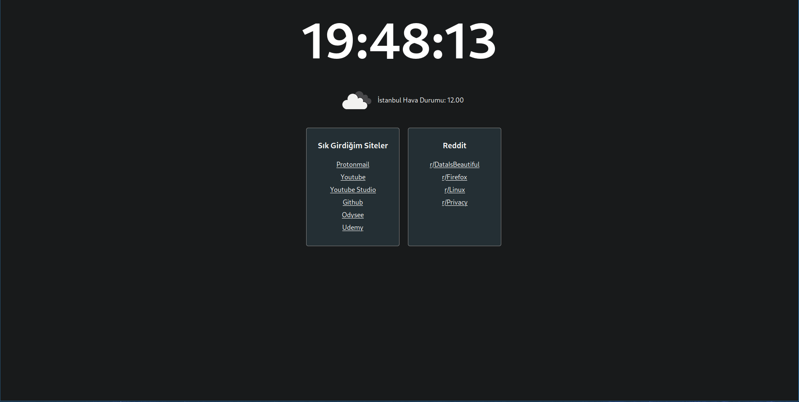

# Custom Homepage

I was typing a lot of websites to adress bar and I thought it would be good to create a minimal custom homepage for my taste.



## Running this program locale

Run `npm install` then run `npm run`.

### Adding a custom card

For this you need to create an array inside data folder. For example card3.js and add desired websites to array. An example;

```javascript
export const cards = [
<a href="https://www.protonmail.com/login" target="">
Protonmail
</a>,

  <a href="https://www.youtube.com" target="">
    Youtube
  </a>,
  <a href="https://studio.youtube.com" target="">
    Youtube Studio
  </a>,

  <a href="https://www.github.com" target="">
    Github
  </a>,

  <a href="https://www.odysee.com" target="">
    Odysee
  </a>,

  <a href="https:/www.udemy.com" target="">
    Udemy
  </a>`,
];
```

After adding the new array, head over to app.js and add a `<Card  title="Desired Title"  list={the.list.you.created} />

### Fetching different city's weather

Open the `weather-fetch.jsx` inside components folder. Change api request from `istanbul` to desired city.

#### Building and using app locally

Open `package.json` and add `"homepage": "."` to first object. Then add <"deploy": "gh-pages -d build"> to the scripts section. After this save and run `npm run build`. You should be able to locally access using `index.html` in the builds folder.
